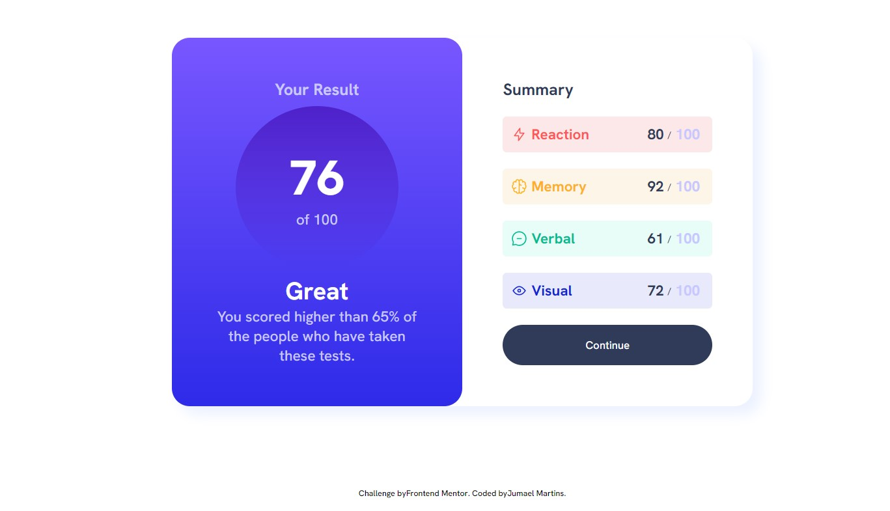

# Frontend Mentor - Results summary component

Segue solução para o desafio [Results summary component challenge on Frontend Mentor](https://www.frontendmentor.io/challenges/results-summary-component-CE_K6s0maV). 

## Table of contents

- [Overview](#overview)
  - [The challenge](#the-challenge)
  - [Screenshot](#screenshot)
  - [Links](#links)
- [My process](#my-process)
  - [Built with](#built-with)
  - [What I learned](#what-i-learned)
  - [Continued development](#continued-development)
  - [Useful resources](#useful-resources)
- [Author](#author)

## Overview

### The challenge

Usuarios deverão ser capazes de:

- Ter a melhor visualização do conteudo adaptada para cada tipo de tela.
- Efeito visual de hover ao interagir com o botão.

### Screenshot




### Links

- Solution URL: [https://github.com/jumaelmartins/Frontend-Mentor--Results-summary-component](https://github.com/jumaelmartins/Frontend-Mentor--Results-summary-component)
- Live Site URL: [https://frontend-mentor-results-summary-component.vercel.app/](https://frontend-mentor-results-summary-component.vercel.app/)

## My process

### Built with

- Semantic HTML5 markup
- CSS custom properties
- Flexbox
- SCSS

### What I learned

Este é um projeto bem simples, já fiz outros mais complexos, porem utilizei ele pra poder aprender um pouco de SASS, eu comecei a estudar agora essa ferramenta e estava querendo praticar um pouco do que li na documentacao e assistir em videos.

como era um projeto pequeno não tem muito codigo, porem conseguir por em pratica alguns conceitos do SASS.

utilizei variaveis, maps, mixins, partials.


```css
/*mixin criado de um efeito degrader*/

@mixin bgGradientOne () {
    background: linear-gradient(
      map-get($gradientColors, "violetBlue"),
      map-get($gradientColors, "persianBlue")
    );
}

/*map criado com as cores primarias*/
$primaryColors: (
     lightRed: hsl(0, 100%, 67%),
     orangeyYellow: hsl(39, 100%, 56%), 
     greenTeal: hsl(166, 100%, 37%), 
     cobaltBlue:hsl(234, 85%, 45%)
);
```

If you want more help with writing markdown, we'd recommend checking out [The Markdown Guide](https://www.markdownguide.org/) to learn more.

**Note: Delete this note and the content within this section and replace with your own learnings.**

### Continued development

Use this section to outline areas that you want to continue focusing on in future projects. These could be concepts you're still not completely comfortable with or techniques you found useful that you want to refine and perfect.

**Note: Delete this note and the content within this section and replace with your own plans for continued development.**

### Useful resources

- [SASS Documentation](https://sass-lang.com/documentation/) - Documentação oficial do SASS.
- [SASS Essential Training](https://www.linkedin.com/learning/sass-essential-training-15630917/how-can-sass-help-build-sites?autoplay=true) - Esse curso me ajudou entender o basico do SASS, é uma introdução rapida e objetiva recomendo se voce tiver o linkedin learning.
- [ChatGPT](https://chat.openai.com/chat) - É uma ferramenta excellente tem me ajudado bastante a tirar duvidas

## Author

- Portifolio - [Portifolio_JumaelMartins](https://portfolio-jumaelmartins.vercel.app/)
- Linkedin - [@jumael-martins](https://www.linkedin.com/in/jumael-martins/)
- GitHub - [@jumaelmartins](https://github.com/jumaelmartins)
- Frontend Mentor - [@jumaelmartins](https://www.frontendmentor.io/profile/jumaelmartins)

